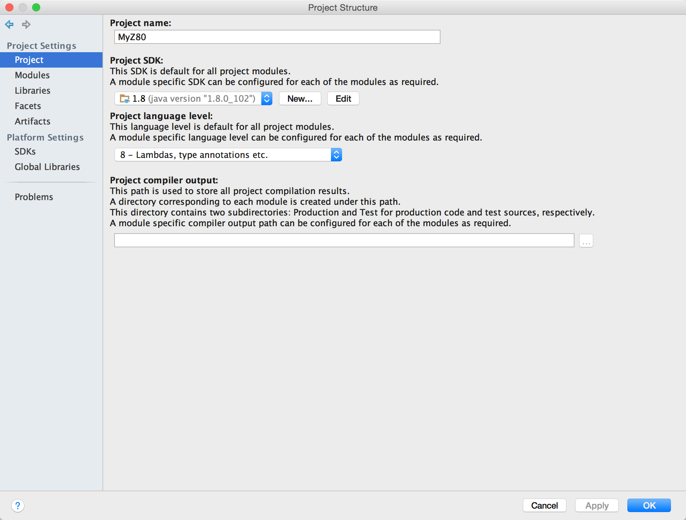
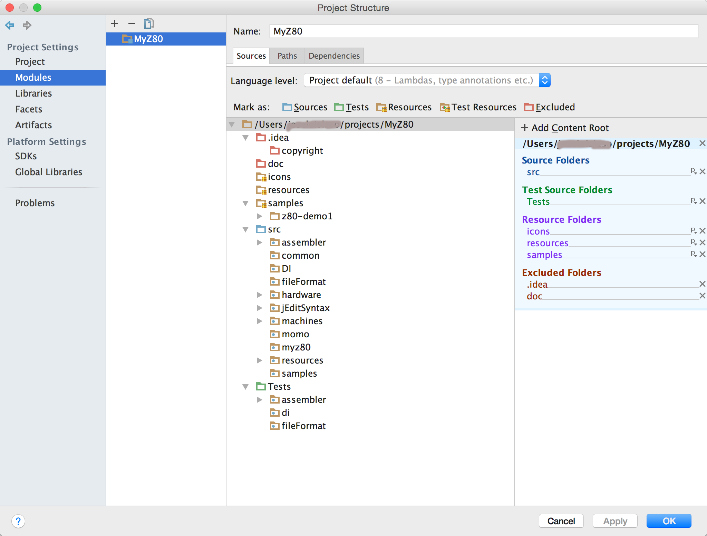
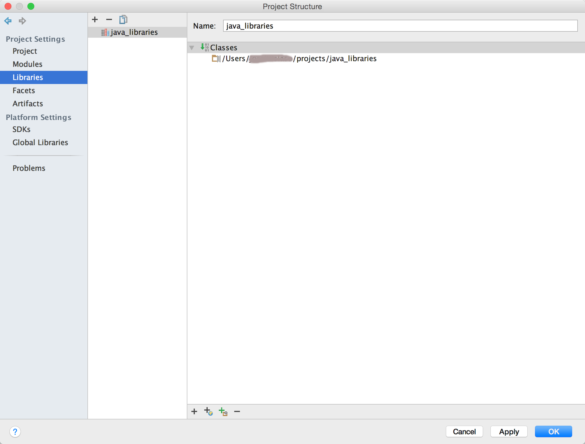
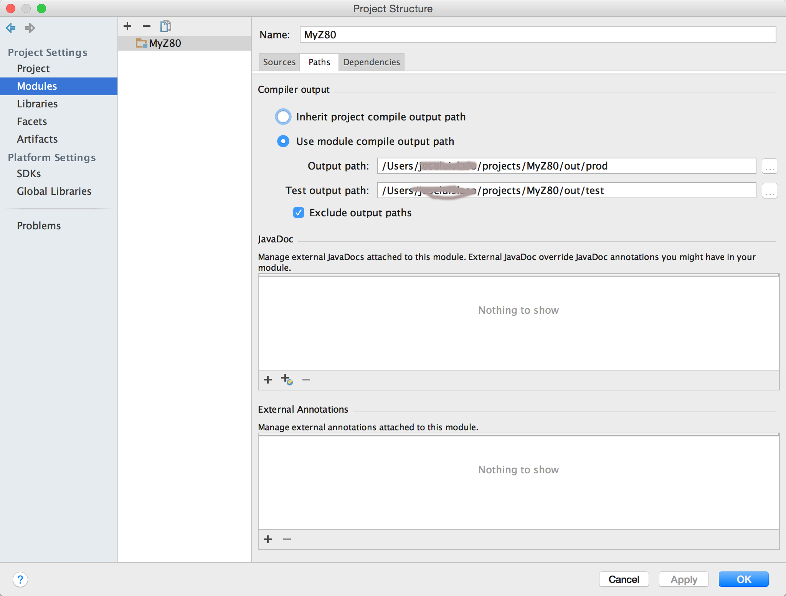

# How to prepare your environment

Install IntelliJ CE (Community Edition)

## Install java on the system

mostly

- brew update
- brew cask java

## Install java as your project's JDK

I am using JDK_1_8, don't know if going to work with a less version

Go to File->Project Structure->Project



## Set the source of the projects

Go to File->Project Structure->Modules->Sources and with the right click select the type of each folder in the project



## Set libraries' path 

Go to File->Project Structure->Libraries->(+) Plus sign

I usually download all of the dependencies in one folder and link it to the project



## Establish the output folder for production and test files

you can use whatever you want, in my case I prefer to have a git_ignored folder inside the project to do that,
so, if you are going to use mine, just create the folder in terminal with ```mkdir -p out/prod out/test```

Go to File->Project Structure->Modules->Path




# Dependencies (libraries)

- Junit   (https://github.com/junit-team/junit4/wiki/Download-and-Install)
- Apache    (https://hc.apache.org/downloads.cgi)
- Json.org   (http://www.java2s.com/Code/Jar/j/Downloadjavajsonjar.htm)
